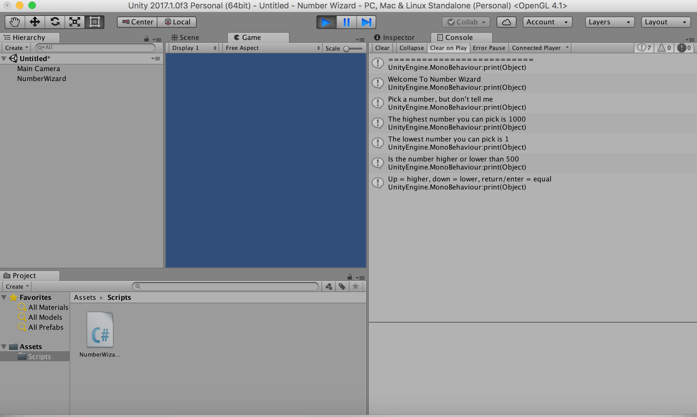
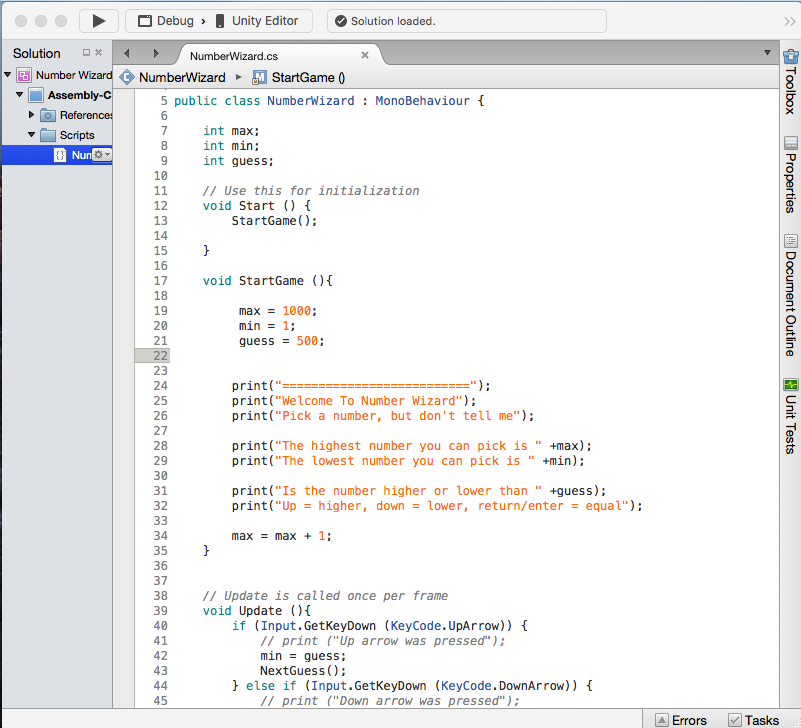

First Unity Video Game
======================

Number Wizard:
==============
Synopsis:
---------
Create a number guessing game using the console in Unity. 
Learnt how to use variables, functions, scope, if and else statements using C# language. 

Preview: 
--------

